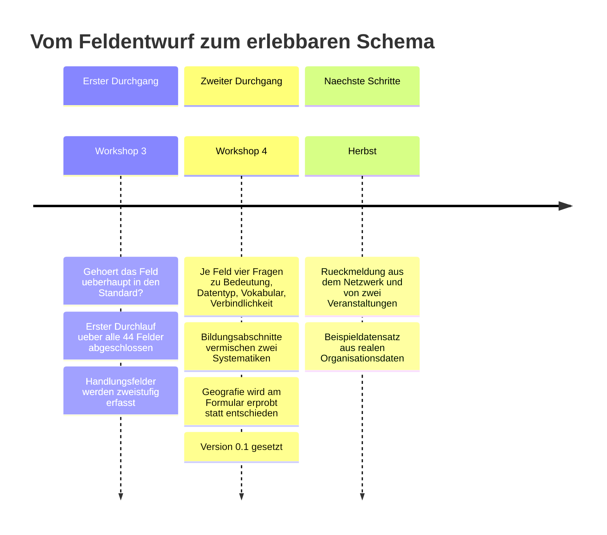
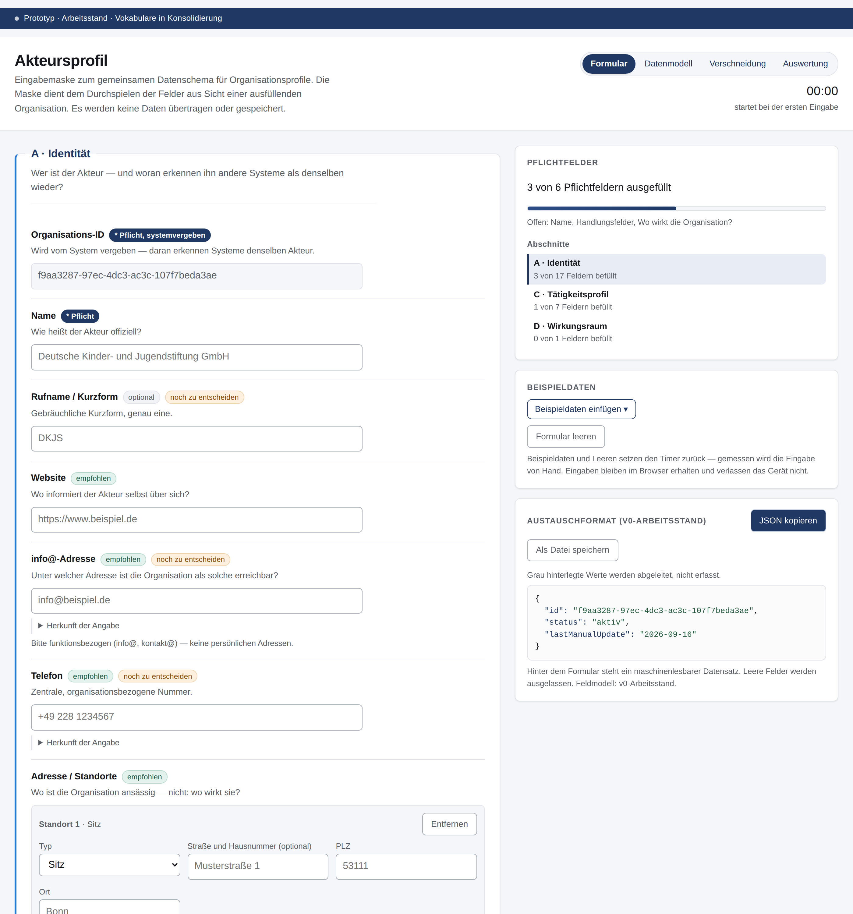
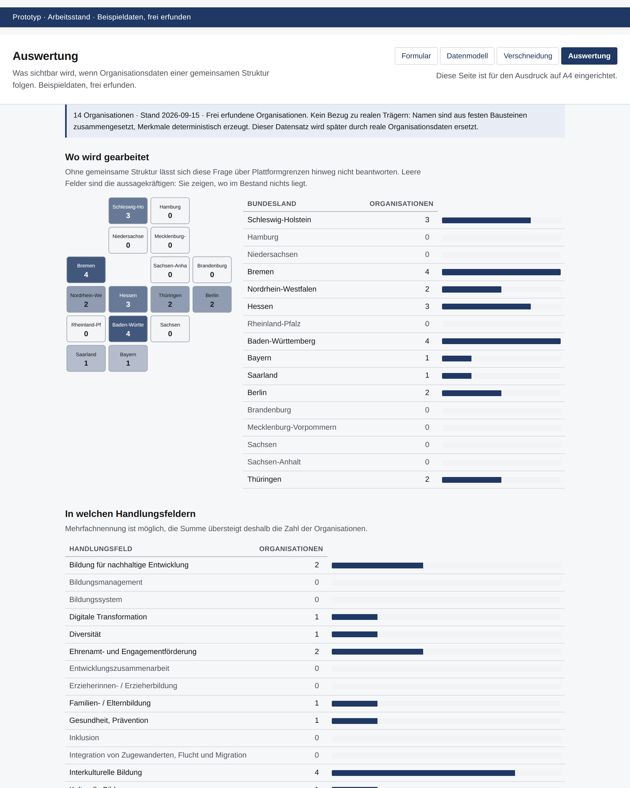

# Eine gemeinsame Sprache für unsere Wirkung

**Ein gemeinsames Datenschema für Organisationsprofile im gemeinnützigen
Bildungssektor.** Erarbeitet im Koordinierungskreis Außerschulische
Bildungsanbieter (KKAB).

[**→ Formular ausprobieren**](https://tfeit.github.io/civic-edu-standard/) ·
[Datenmodell](https://tfeit.github.io/civic-edu-standard/schema.html) ·
[Verschneidung](https://tfeit.github.io/civic-edu-standard/simulation.html) ·
[Auswertung](https://tfeit.github.io/civic-edu-standard/auswertung.html)

---

## Worum es geht

Mehrere Verbände im KKAB repräsentieren zusammen über 400 Organisationen.
Jeder erhebt Daten über seine Mitglieder nach eigenen Kategorien, in eigenen
Systemen, für eigene Plattformen. Die Folge ist strukturelle
Inkompatibilität: Sektorweite Auswertungen, Vergleiche oder die
Identifikation unterversorgter Regionen sind nur mit erheblichem manuellem
Aufwand möglich — wenn überhaupt.

**Das Ziel** ist ein gemeinsames Datenschema für Organisationsprofile, im
Arbeitsgebrauch *Akteursprofil*, das die beteiligten Plattformen als
Austauschformat nutzen.

**Nicht das Ziel** ist, Plattformen zu ersetzen oder zu zentralisieren. Jede
bleibt bestehen und bedient ihre Zielgruppen. Standardisiert wird die
Semantik der Daten — die gemeinsame Beschreibungssprache, auf die alle
Systeme abbilden können.

Beteiligt sind Vertreterinnen und Vertreter der Plattformen **Nettiefinder**
(Netzwerk Stiftungen und Bildung), **Kompass Bildungsförderung**,
**Lernraumradar** sowie **MINT vernetzt** und **junge Tüftler**.

---

## Wo wir stehen

> **Version 0.1**, gesetzt am 15. September 2026 unter dem Vorbehalt
> *safe enough to try*. Keine abschließende Festlegung, sondern eine
> Arbeitsgrundlage.

| | |
|---|---|
| **44** | geprüfte Felder |
| **21** | aufgenommen |
| **18** | für Version 1.0 zurückgestellt, mit dokumentierter Begründung |
| **6** | offene Fragen, zu denen Rückmeldung gebraucht wird |

Die Blöcke Jahresstatistik und Personenkontext sind vollständig
zurückgestellt. **Version 1.0 ist ein reines Organisationsprofil.**

---

## Die Entwicklung



### Workshop 3 — die Existenzfrage

Der erste Durchgang entscheidet nur, **ob** ein Feld in den Standard gehört.
Das verhindert, dass die Existenzfrage eines Feldes an einer
Vokabulardiskussion scheitert.

Wichtigster Beschluss: **Handlungsfelder werden zweistufig erfasst.**
Plattformen dürfen feiner erheben, als der Standard abbildet — eine der
beteiligten Plattformen arbeitet bereits so. Das löst den Konflikt zwischen
Erfassungsnähe und Auswertbarkeit, ohne dass eine Seite nachgeben muss.

### Workshop 4 — Vokabular, Datentyp, Verbindlichkeit

Seit dem vierten Workshop werden je Feld vier Fragen beantwortet: Was
bedeutet es? Welcher Datentyp steckt dahinter? Festes Vokabular,
Mehrfachauswahl oder Freitext? Welche Verbindlichkeit?

**Was entschieden wurde**

| Feld | Entscheidung | Begründung in Kurzform |
|---|---|---|
| Nachhaltigkeitsziele | aufgenommen, freiwillig | Intern kaum trennscharf — aber das einzige global definierte, sektorenübergreifende Kategoriensystem. Kosten-Nutzen-Argument, kein Erkenntnisargument. |
| Status | aufgenommen, Liste reduziert | Beendete Organisationen bleiben im Bestand, sonst verweisen vergangene Kooperationen ins Leere. Entscheidend ist aktiv gegenüber aufgelöst. |
| Geografischer Bezug | aufgenommen | Innerhalb des eigenen Bestands kaum differenzierend — bei der Verschneidung mit anderen Beständen entscheidend. Kein eigenes Geo-Vokabular. |
| Zielgruppen | aufgenommen, Rollenmodell | Lassen sich **nicht** aus Bildungsabschnitten ableiten. Leitfrage: *Wer nimmt an euren Angeboten teil?* |
| Handlungsfelder | 23 Begriffe bestätigt | Damit ist die offene Frage beantwortet: es sind 23, nicht 24. Lobbyarbeit fehlt in der Liste. |

**Was bewusst offen blieb**

- **Bildungsabschnitte.** Die bisherige Liste vermischte zwei Systematiken.
  Beide liegen jetzt getrennt vor, mit einer Übersetzung dazwischen — die
  Entscheidung fällt nach fachlicher Rückmeldung. → [BILDUNGSABSCHNITTE.md](BILDUNGSABSCHNITTE.md)
- **Geografische Auflösung.** Statt zu entscheiden, wurden drei Varianten in
  den Prototyp gebaut. Geprüft wird daran, was Ausfüllende tatsächlich
  verstehen.

---

## Wie gearbeitet wird

Fünf Grundsätze, die sich aus der Arbeit ergeben haben:

**Zwei Ebenen.** Erfassung darf feiner sein als Auswertung. Erfasst wird
bildungsspezifisch, ausgewertet über eine gröbere, sektorweit vergleichbare
Kodierung.

**Zwei Durchgänge.** Erst die Existenzfrage, dann Vokabular und
Verbindlichkeit.

**Zurückstellen statt streichen.** Felder, die es nicht in Version 1.0
schaffen, werden mit Begründung zurückgestellt. Das hält spätere Versionen
offen und macht Entscheidungen nachvollziehbar, wenn jemand Monate später
nachfragt.

**Erhebung ist nicht Publikation.** Eine Plattform erhebt, ob eine
Organisation fördernd oder operativ arbeitet, veröffentlicht es aber
bewusst nicht — um zu verhindern, dass das Netzwerk als Fundraising-Verteiler
genutzt wird. Der Standard muss das abbilden können.

**Identität und Wirkungsraum sind zweierlei.** Ein Hauptsitz in Berlin mit
einem Lernlabor in München erzeugt einen Standort *und* ein Wirkungsgebiet.
In einem Feld zusammengelegt, wäre die Auswertung wertlos.

Das Spannungsfeld, in dem alle Entscheidungen liegen, markieren zwei Sätze
aus der Arbeitsgruppe:

> Wenn der Standard plötzlich Goldstandard ist und keiner kann ihn erfüllen,
> dann ist es auch Quatsch.

> Ein Standard muss ambitioniert sein — man kann nicht die schlechteste
> aller Grundgesamtheiten zur Grundlage machen.

---

## Der Prototyp

Kein Produkt, sondern ein Verständigungsmittel. Er zeigt links, was eine
Organisation eingeben würde, und rechts, was daraus als Austauschformat
entsteht. Für die offenen Vokabularfragen dient er als Testumgebung.

**Härtestes Abnahmekriterium:** Eine kleine Initiative muss das Formular in
unter zehn Minuten ausfüllen können. Gemessen: rund eine Minute reine
Eingabe für ein vollständiges Profil.

### Vier Ansichten

| | Was sie zeigt | |
|---|---|---|
| **Formular** | Die Eingabemaske aus Sicht einer ausfüllenden Organisation, mit Live-Vorschau des Austauschformats. | [öffnen](https://tfeit.github.io/civic-edu-standard/) |
| **Datenmodell** | Das Schema als Netz — umschaltbar zwischen Struktur und einem fiktiven Akteursnetz. | [öffnen](https://tfeit.github.io/civic-edu-standard/schema.html) |
| **Verschneidung** | Kreuztabelle: was sichtbar wird, wenn man zwei Merkmale gegeneinander legt. | [öffnen](https://tfeit.github.io/civic-edu-standard/simulation.html) |
| **Auswertung** | Für alle, die mit einem Austauschformat nichts anfangen können. Druckbar auf A4. | [öffnen](https://tfeit.github.io/civic-edu-standard/auswertung.html) |



*Links das Formular, rechts der entstehende Datensatz. Grau hinterlegte
Werte werden abgeleitet, nicht erfasst.*



*Was sichtbar wird, wenn Organisationsdaten einer gemeinsamen Struktur
folgen. Leere Zeilen sind die aussagekräftigen: Sie zeigen, wo im Bestand
nichts liegt.*

### Lokal öffnen

Kein Build, kein Server, keine Abhängigkeiten:

```
prototype/index.html im Browser öffnen
```

---

## Wo Rückmeldung gebraucht wird

Sechs Punkte, zu denen die Arbeitsgruppe noch keine tragfähige Antwort hat:

1. **Bildungsabschnitte.** Welches der beiden Modelle bildet die Praxis
   besser ab? Ist die Differenzierung innerhalb der schulischen Bildung
   nötig? Wie werden Übergänge abgebildet, ohne die Stringenz zu verlieren?
2. **Geografische Auflösung.** Welche Granularität ist realistisch pflegbar —
   und welche wird für Auswertungen tatsächlich gebraucht?
3. **Zielgruppenvokabular.** Wie lassen sich Zielgruppen so fassen, dass sie
   über Organisationstypen hinweg vergleichbar bleiben, ohne zu grob zu
   werden? Aus der Erprobung am Formular kamen dazu zwei konkrete Fragen:
   Soll die Bezeichnung eine Auswahlliste statt Freitext werden? Und können
   Institutionen wie Schulen eine eigene Rolle bleiben, oder werden die
   Rollen zusammengefasst? Solange das offen ist, bleibt das Feld Freitext —
   eine Auswahlliste wäre bereits die Entscheidung.
4. **Handlungsfelder.** Die 23 Begriffe sind nicht alle dieselbe Art von
   Kategorie; Diversität und Inklusion überschneiden sich; ein Feld für
   Interessenvertretung fehlt.
5. **Anreize.** Die offenste Frage: Welcher Hebel bringt Organisationen dazu,
   Daten bereitzustellen? Sichtbarkeit allein reicht nach mehrjähriger
   Erfahrung nicht.
6. **Aufwand.** Was braucht eine Organisation, um solche Daten überhaupt
   liefern zu können? Die Antwort dürfte zwischen rein ehrenamtlichen
   Initiativen und Organisationen mit hauptamtlicher Struktur deutlich
   verschieden ausfallen.

**Mitwirkung** ist an mehreren Stellen möglich: Rückmeldung zu diesen Fragen,
Bereitstellung von Beispieldatensätzen aus bestehenden Plattformen, oder
Mitarbeit an der Weiterentwicklung. Siehe [CONTRIBUTING.md](CONTRIBUTING.md).

---

## Wo finde ich was?

| Ich möchte … | Datei |
|---|---|
| den ausführlichen Sachstand lesen | [SACHSTAND.md](SACHSTAND.md) |
| wissen, warum es zwei Bildungsmodelle gibt | [BILDUNGSABSCHNITTE.md](BILDUNGSABSCHNITTE.md) |
| die 23 Handlungsfelder und ihre Abgrenzungen sehen | [HANDLUNGSFELDER.md](HANDLUNGSFELDER.md) |
| wissen, woher ein Vokabular stammt und wie belastbar es ist | [prototype/VOKABULARSTAND.md](prototype/VOKABULARSTAND.md) |
| nachvollziehen, was sich wann geändert hat | [prototype/CHANGELOG.md](prototype/CHANGELOG.md) |
| ein Vokabular ändern | `prototype/vocab/*.json` |
| ein Feld ändern | `prototype/fields.js` |
| am Code mitarbeiten | [CLAUDE.md](CLAUDE.md) |

---

## Woran angeknüpft wird

Nichts davon wird neu erfunden:

- **Amtliche Gemeinde- und Regionalschlüssel** für den Raumbezug
- **DCAT-AP.de** für die Publikation als offene Daten
- **ISCED 2011** als internationale Referenz für Bildungsstufen
- **Wikidata** als öffentlicher, nicht-kommerzieller Identifikator
- **ICNPO** und die **Engagementfelder der Zivilgesellschaftsstatistik** als
  Aggregationsachsen nach außen — abgeleitet, nicht abgefragt

**Vorbilder:** Nova SBE Social Database (Portugal) für die Machbarkeit
sektorweiter Aggregation · IATI für föderierte Datenpublikation ohne zentrale
Datenhaltung · Social Reporting Standard als inhaltlicher Bezugspunkt im
deutschen Kontext.

---

## Lizenz

Siehe [LICENSE](LICENSE).
